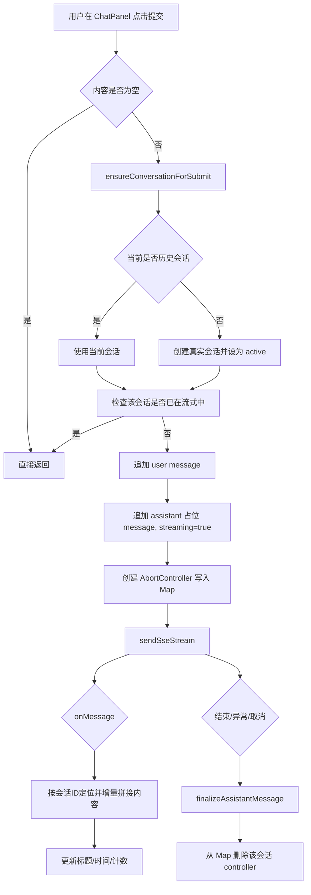
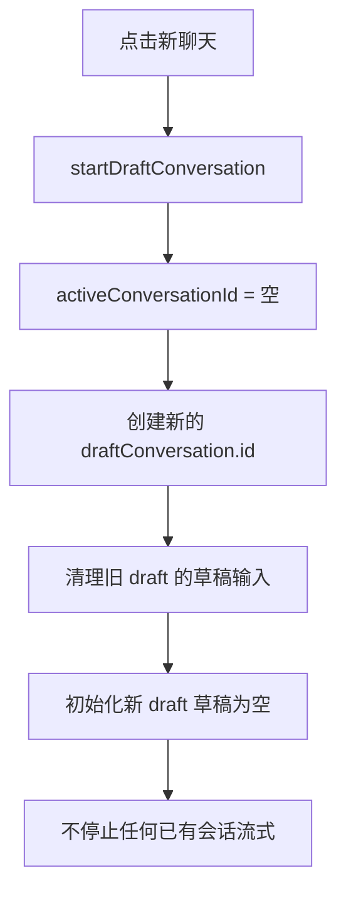
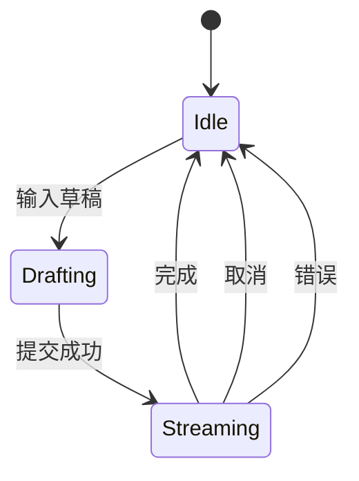

# 会话隔离流式架构复盘文档

## 1. 背景与目标

本次改造目标是让聊天系统满足以下行为：

- 新建聊天不影响已有会话的流式输出。
- 回到原会话后，原会话继续保持自己的流式状态。
- 每个会话的输入框草稿独立保存，互不覆盖。
- 取消仅取消当前会话，不误伤其他会话。

对应代码主入口：

- `src/views/home/composables/useConversationManager.js`
- `src/views/home/components/ChatPanel.vue`
- `src/views/HomeView.vue`

---

## 2. 总体设计

### 2.1 核心思想

把原先“全局单一流式状态”改为“会话级状态容器”：

- 流式控制：`Map<conversationId, AbortController>`
- 输入草稿：`Map<conversationId, string>`

这样每个会话都有独立生命周期，不会相互污染。

### 2.2 关键数据结构

```js
// 会话级流式控制器
streamingControllersByConversationId: Map<string, AbortController>

// 会话级输入草稿
 draftInputByConversationId: Map<string, string>
```

---

## 3. 关键流程图

### 3.1 提交流程（含草稿提升）



### 3.2 新建聊天流程



### 3.3 取消流程（精准取消）

```mermaid
flowchart TD
  A[ChatPanel cancel] --> B[emit cancel with conversation.id]
  B --> C[useConversationManager.stopStreaming(conversationId)]
  C --> D{Map 中是否存在该会话 controller}
  D -- 否 --> X[返回]
  D -- 是 --> E[abort 该 controller]
  E --> F[可选调用后端 stop API]
  F --> G[该会话 finally 阶段清理 Map]
```

---

## 4. 前端状态机说明

### 4.1 单会话状态机



### 4.2 多会话并行语义

多个会话可同时处于不同状态：

- 会话 A: `Streaming`
- 会话 B: `Drafting`
- 会话 C: `Idle`

系统不再用全局锁阻止 B 提交。

---

## 5. 关键实现点

### 5.1 `useConversationManager.js`

- `ensureConversationForSubmit`：草稿态首次提交时，先提升为真实会话。
- `submitMessage`：只阻止“同一会话”并发提交，不阻止其他会话。
- `stopStreaming`：按 `conversationId` 精确 abort。
- `isActiveConversationStreaming`：基于 `activeConversation.id` 判定当前会话是否流式中。

### 5.2 `ChatPanel.vue`

- `senderText`：受控输入，读写会话级草稿。
- `senderLoading`：由当前会话 `messages` 中 `assistant.streaming` 推导。
- `handleCancel`：透传当前 `conversation.id`，保证取消定位准确。

---

## 6. 为什么之前会出现串扰

旧实现的典型问题：

- 使用全局 `isStreaming` + 全局 `AbortController`。
- 新建聊天后输入框 loading 仍取全局状态。
- 提交时因全局锁被拦截，导致“看起来没反应”。

改造后：

- 状态作用域从“全局”缩小到“conversationId”。
- UI loading 判定从“全局布尔”收敛到“当前会话消息事实”。

---

## 7. 复盘测试用例清单

### 7.1 核心回归

1. A 会话流式中，新建聊天 B，B 输入框应可输入且不 loading。  
2. B 提交后，A 与 B 各自独立流式。  
3. 在 B 点击取消，不应停止 A。  
4. 切回 A，A 的流式内容继续增长直到完成。  
5. A/B 草稿输入互不覆盖。  

### 7.2 异常路径

1. 流式中删除当前会话：仅该会话中止。  
2. SSE 中断：assistant 占位消息应被 finalize。  
3. 后端 stop API 失败：本地中断逻辑仍有效。  

---

## 8. 后续可选优化

- 在侧栏显示“流式中”小圆点（按会话）。
- 为 `submitMessage`、`stopStreaming` 增加埋点日志（会话 ID、耗时、结果）。
- 若后续状态继续增多，可迁移到 Pinia store，保留同样的会话级 Map 设计。

---

## 9. 快速排障脚本建议（开发环境）

建议在以下节点打印 `conversationId`：

- `submitMessage` 入参
- `setStreamingController`
- `stopStreaming`
- `finally deleteStreamingController`

如果出现串扰，优先检查：

- 是否仍有任何地方使用“全局流式锁”决定提交。
- ChatPanel 的 loading 是否被外部状态覆盖。

