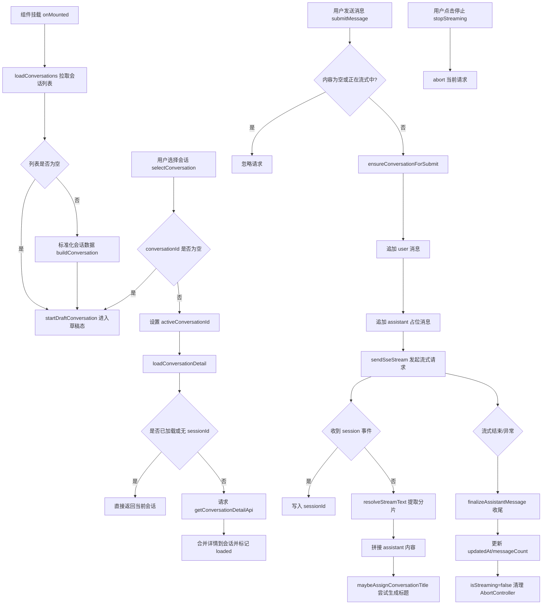

# useConversationManager 流程图

```mermaid
flowchart TD
    A[组件挂载 onMounted] --> B[loadConversations 拉取会话列表]
    B --> C{列表是否为空}
    C -->|是| D[startDraftConversation 进入草稿态]
    C -->|否| E[标准化会话数据 buildConversation]
    E --> D

    F[用户选择会话 selectConversation] --> G{conversationId 是否为空}
    G -->|是| D
    G -->|否| H[设置 activeConversationId]
    H --> I[loadConversationDetail]
    I --> J{是否已加载或无 sessionId}
    J -->|是| K[直接返回当前会话]
    J -->|否| L[请求 getConversationDetailApi]
    L --> M[合并详情到会话并标记 loaded]

    N[用户发送消息 submitMessage] --> O{内容为空或正在流式中?}
    O -->|是| P[忽略请求]
    O -->|否| Q[ensureConversationForSubmit]
    Q --> R[追加 user 消息]
    R --> S[追加 assistant 占位消息]
    S --> T[sendSseStream 发起流式请求]

    T --> U{收到 session 事件}
    U -->|是| V[写入 sessionId]
    U -->|否| W[resolveStreamText 提取分片]
    W --> X[拼接 assistant 内容]
    X --> Y[maybeAssignConversationTitle 尝试生成标题]

    T --> Z{流式结束/异常}
    Z --> AA[finalizeAssistantMessage 收尾]
    AA --> AB[更新 updatedAt/messageCount]
    AB --> AC[isStreaming=false 清理 AbortController]

    AD[用户点击停止 stopStreaming] --> AE[abort 当前请求]
```
